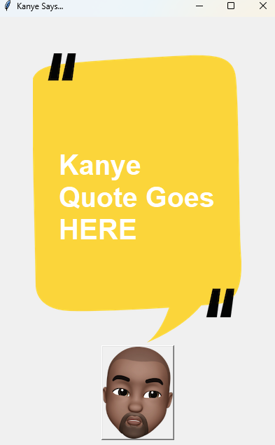

# Kanye Quotes App

This is a simple Python application that displays random quotes from the one and only Kanye West using the kanye.rest API. The app is built using the Tkinter library for the graphical user interface.

## Features

- Fetches random Kanye West quotes from the API on click.
- Displays the fetched quote in a graphical user interface.
- Simple and intuitive design.